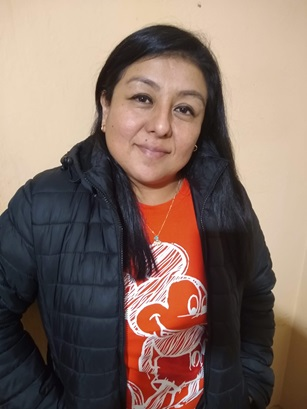

# Erika Campos Vera
Hola,soy **Erika** empece a cursar en la  **UNAHUR** durante la pandemia. Empece a cursar el  **Profesorado de Ingles** de manera virtual,
lo cual fue un gran desafio, durante un cuatrimestre curse la **Tecnicatura en Programacion** como segunda carrera. Pero  me dio covid y no
pude continuar cursando. Al volver solo retome la tecnicatura en programacion pensando que tendria mas oportunidades laborales.

Soy Asistente Terapeutico pero trabaje mas de 15 años como Supervisora de Ventas, Atencion al Cliente. Espero pronto poder desenpeñarme en el
area de la informatica

## Cursos Realizados :book:
* Diplomatura Desarrollo Software Web 
* JavaScript .
* Wordpress. 
* Ingles. 
* Portugues. 

## Links importantes :monocle_face:
- [x] [Github](https://github.com/Erika-Campos-V)
- [x] [Linkedin](https://www.linkedin.com/in/erika-campos-vera) 

